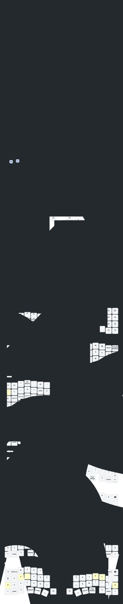

# ErgoTravel ZMK

This is the ZMK configuration for my [ErgoTravel](https://github.com/jpconstantineau/ErgoTravel) keyboard with nice!nano v2 MCU boards (or [compatible "SuperMini" boards](https://github.com/joric/nrfmicro/wiki/Alternatives#supermini-nrf52840).

The keymap implements my [Colemax-Maxtend](https://github.com/mhantsch/maxtend) configuration.

This config supports [ZMK Studio](https://github.com/zmkfirmware/zmk-studio).

## Keymap Diagram

